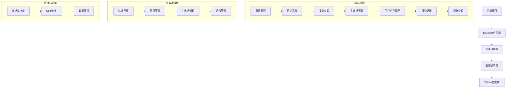
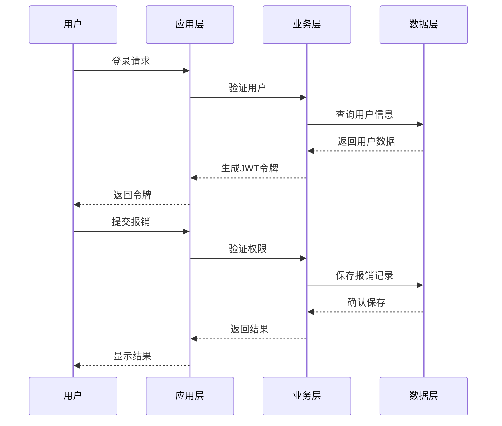
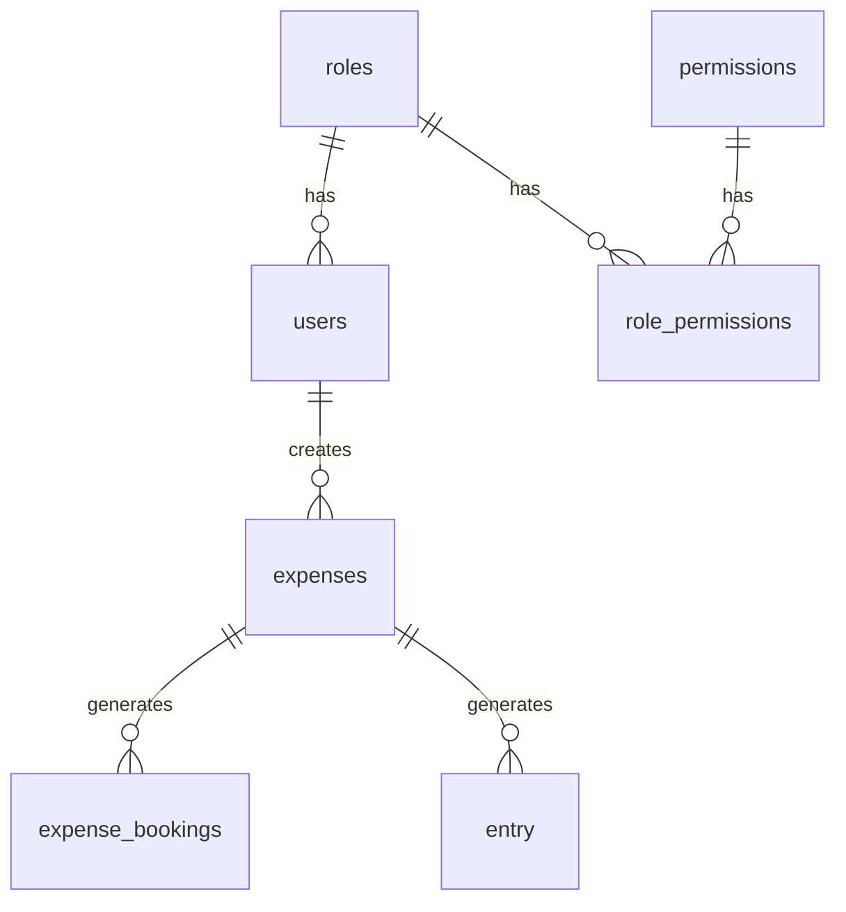
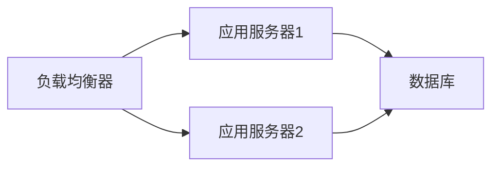

# 企业报销系统架构设计

## 1. 系统架构图

## 2. 数据流图

## 3. 模块交互说明

### 3.1 认证授权模块
- 负责用户登录验证
- 生成和验证JWT令牌
- 权限检查

### 3.2 费用管理模块
- 报销记录的CRUD操作
- 费用状态管理
- 数据验证

### 3.3 主数据管理模块
- 部门、公司、预算科目等基础数据维护
- 数据导入导出
- 数据关联管理

### 3.4 记账管理模块
- 生成记账凭证
- 借贷平衡检查
- 凭证状态管理

## 4. 数据库设计

### 4.1 核心表关系

### 4.2 主要表说明
- users: 用户信息
- roles: 角色定义
- permissions: 权限定义
- expenses: 报销记录
- expense_bookings: 记账记录
- entry: 凭证分录
- config: 主数据配置

## 5. 安全设计

### 5.1 认证流程
1. 用户提交登录信息
2. 验证用户名密码
3. 生成JWT令牌
4. 令牌包含用户ID和角色信息

### 5.2 权限控制
1. 基于角色的访问控制
2. 细粒度的功能权限
3. 数据级别的权限控制

## 6. 部署架构

